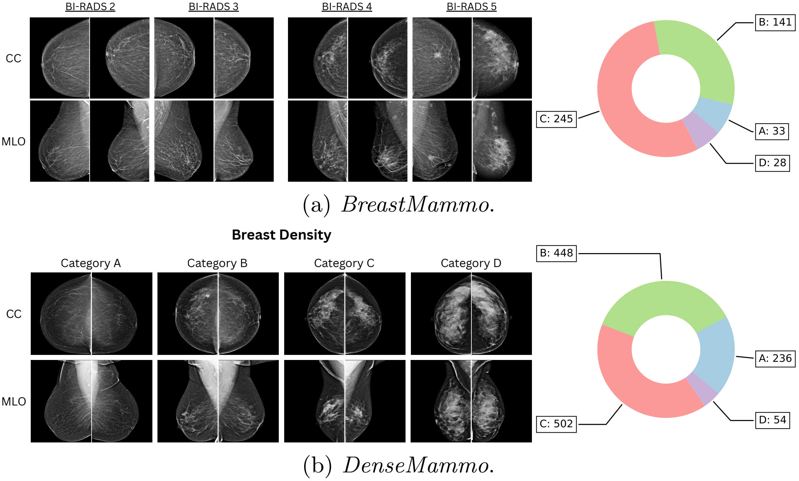
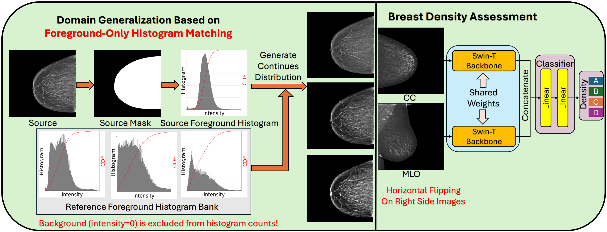
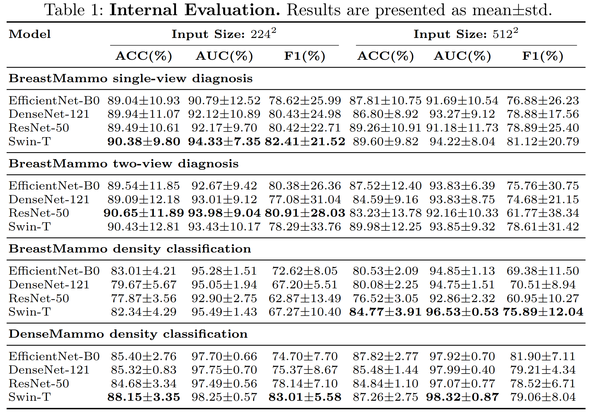
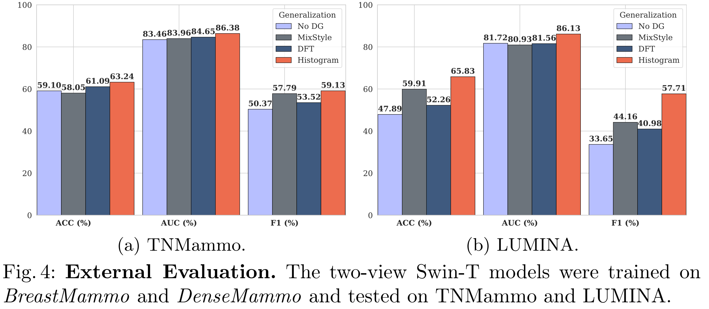

# [MICCAI2026 Workshop Deep-Brea3th] BreastMammo and DenseMammo: Benchmarks for Mammography Domain Generalization 

## Representative Samples And Density Distributions
<p align="center">
  
</p>

## Histogram-Based Domain Generalization Pipeline
<p align="center">
  
</p>

# Abstract
Breast density classification is a critical component of breast cancer risk assessment, yet AI models often struggle to generalize across clinical sites due to vendor-specific acquisition styles. In this work, we introduce two new datasets, BreastMammo and DenseMammo, to facilitate robust multi-view mammography research. We propose a domain generalization framework that utilizes a foreground-only histogram matching protocol to resolve the domain shift issue arising from disparate clinical sources. Internal evaluation using a 5-fold cross-validation protocol demonstrates the efficacy of our approach, with the Swin Transformer backbone achieving a peak AUC of 98.32% for density classification. External evaluation on the TNMammo and LUMINA datasets demonstrates that the proposed approach consistently reduces domain shift, significantly outperforming prominent domain generalization paradigms, including MixStyle and Discrete-Fourier-Transform-based frameworks.

# 📄 Paper link:

arXiv: https://arxiv.org/abs/2608.10271

# 📊 Dataset:

BreastMammo: https://osf.io/n4yr2/

DenseMammo: https://osf.io/4azcr/

We provide both 16-bit PNG and DICOM formats. This repository uses the PNG files.

# 🧠 Pre-trained Weights:
https://huggingface.co/phy710/BreastMammo

# 📌 Repository Structure

The codebase is organized into modules corresponding to internal dataset benchmarks and external domain generalization evaluations:

```text
├── BreastMammo/
│   ├── density/               # Breast density classification (5-fold CV)
│   └── diagnosis/
│       ├── single/            # Single-view pathology diagnosis (benign vs. malignant)
│       └── two/               # Two-view (CC + MLO) pathology diagnosis
├── DenseMammo/
│   └── density/               # 4-view screening density classification (5-fold CV)
├── external/
│   ├── LUMINA/                # Unseen domain baseline evaluation (No DG)
│   ├── LUMINA-Histogram/      # Proposed foreground-only histogram matching DG
│   ├── LUMINA-DFT/            # Discrete Fourier Transform-based DG baseline
│   └── LUMINA-MixStyle/       # Feature-level MixStyle DG baseline
├── generative/
│   ├── dft.py                 # DFT-based image style synthesis & background masking
│   ├── histogram.py           # Foreground-only histogram matching generation
│   ├── dataset.py             # Data loading for generative alignment
│   └── seed.py                # Reproducibility seed configuration
├── figures/                   # Visualizations for pipeline, samples, and benchmark plots
├── LICENSE
└── README.md
```
# 🚀 Usage & Experiments
The trained weights are available at https://huggingface.co/phy710/BreastMammo. If you want to test our trained models, please download them and put the `saved` folder into the corresponding task. 

## Internal Benchmarks
Please use folders `BreastMammo` and `DenseMammo` for this section.

### Training and Testing
In each task, go to the corresponding folder, then run

    ./main.sh [-model model_name] [-input_size size] [-data_path data_path]

Here, `[-input_size]` can be `224` or `512`, `[-model]` can be `efficientnet_b0`, `densenet121`, `resnet50`, and `swin_t`. Other models may be supported but are not tested yet.

For example:

    ./main.sh -model swin-T -input_size 224 -data_path /dataset/BreastMammo_PNG

You can get the test results by running the command like the following:

    python fold_test.py --model --data-path /dataset/BreastMammo_PNG --model swin_t --input-size 224

## External Domain Generalization Evaluation
Please use folders "generative" and "external" for this section.
### Generative Synthetic Images
You may run `histogram.py` or `dft.py` for histogram-based and DFT-based domain generation. You may revise the following code at `lines 59--65` in `histogram.py` and `lines 99--105` in `dft.py` to choose the source and reference dataset.

To generate synthetic BreastMammo images in the DenseMammo domain:

    source_root = BreastMammo_root
    source = BreastMammo_density(root = BreastMammo_root)
    ref = DenseMammo_density(root= DenseMammo_root)
This will generate folders `BreastMammo_XXX_YYY`, where `XXX` is `Histogram` or `DFT`. `YYY` is `25`, `50`, `75`, or `100`, which stands for `α` in `Eq (1)` in our paper, multiplied by `100`.

To generate synthetic DenseMammo images in the BreastMammo domain:

    source_root = DenseMammo_root
    ref = BreastMammo_density(root = BreastMammo_root)
    source = DenseMammo_density(root= DenseMammo_root)

This will generate folders `DenseMammo_XXX_YYY`.
  
Then you will put these generated folders where you store BreastMammo_PNG and DenseMammo_PNG (i.e., `/dataset`).

## Training and Testing
In each task, go to the corresponding folder, then run

    ./main.sh -model swin-T -input_size 224 -data_path /dataset/

You can get the test results by running the command like the following:

    python fold_test.py --model --data-path /dataset/ --model swin_t --input-size 224

# Benchmark
<p align="center">
  
</p>

<p align="center">
  
</p>

# Citation
If you use this dataset in your research, please cite our MICCAI paper:

    Hongyi Pan, Gorkem Durak, Halil Ertugrul Aktas, Andrea Mia Bejar, Mustafa Ege Seker, Nebile Alibeyoglu, Rumeysa Guclu, Rana Gunoz Comert Bozkurt, Sibel Ozkan Gurdal, Neslihan Cabioglu, Beyza Ozcinar, Ravza Yilmaz, Vahit Ozmen, Erkin Aribal, Sukru Mehmet Erturk, Yalda Zafari, Mohamed Mabrok, Kayhan Batmanghelich, Mohammad Yaqub, Ziyue Xu, Ulas Bagci. “BreastMammo and DenseMammo: Benchmarks for Mammography Domain Generalization.” MICCAI 2026.
